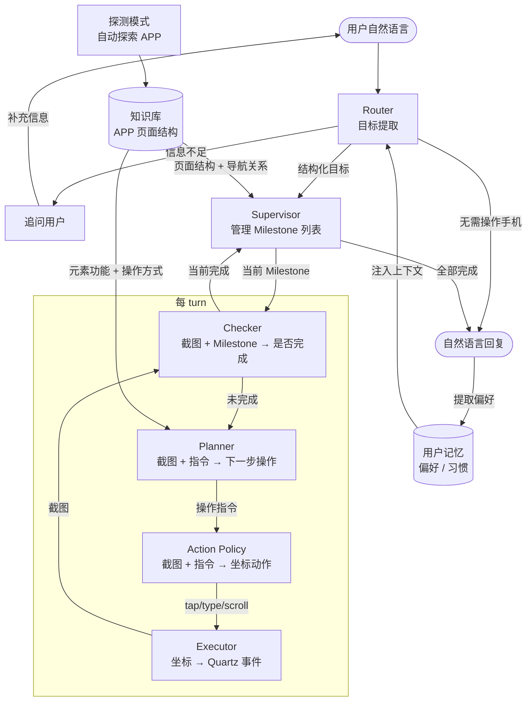

# iphone-use

[English](README.en.md) | 中文

基于 Mac 上的 iPhone Mirroring，通过 [mirroir-mcp](https://github.com/jfarcand/mirroir-mcp) 提供截图与触控能力，用 MCP 协议控制 iPhone 的 AI Agent。给出自然语言目标，Agent 自动截图、理解当前状态、决策下一步操作、执行并循环，直到完成任务。

**多模态小模型（Qwen3.5-35B-A3B）即可驱动复杂的手机操作（跨 APP、长程多步骤、带验收闭环），支持私有化本地部署，无需依赖闭源大模型。**

## 演示

以下演示视频均为 2 倍速播放。

### 对话模式

**操作类**：执行具体动作（发消息、下单、修改设置）

> "把我最近在拼多多上下单的奶粉分享给老 Be，这个性价比高"
>
> 拼多多找订单 → 微信分享给联系人，跨 APP 操作

https://github.com/user-attachments/assets/3b10c74a-99ae-4bbb-a983-767857b62136

**查询类**：从 APP 内读取并汇总信息（账单统计、订单记录、消息摘要）

> "我上周用微信支付花多少钱了？"
>
> 打开微信支付 → 汇总上周账单支出

https://github.com/user-attachments/assets/2deb4026-97e9-4689-bfa7-30472544d3df

### 探测模式

> 自动探索闲鱼 APP 页面结构，生成页面知识库

https://github.com/user-attachments/assets/183b80fd-ba0f-4f14-b599-b7ef3efc4a79

## 架构



**Router**：解析用户消息，判断是否需要操作手机。需要的提取明确目标（做什么）和目标 APP（在哪个应用做），传递给 Supervisor；不需要的直接回复。当信息不足（如未指定 APP、操作不明确）时追问用户。

**Supervisor**：将目标拆解为有依赖关系的 Milestone 子任务，逐个执行并验收。支持多种完成策略（单步确认、滚动采集、重复直到满足条件），遇到卡住时自动 replan。

**Planner**：根据当前截图和操作指令，结合知识库中的页面元素信息，规划下一步具体操作。

**Action Policy**：接收截图和操作指令，输出具体的屏幕坐标动作（tap / type / scroll / drag 等）。

**Executor**：将坐标动作转换为 Quartz 鼠标/键盘事件，经 iPhone Mirroring 控制手机。

**Output**：任务完成后，根据执行过程和屏幕内容生成面向用户的自然语言回复，查询类任务会直接输出提取到的数据。

## 健壮性机制

**Checker** 在每轮执行前对截图做验收判断，确认当前 Milestone 是否真正完成，防止 LLM 幻觉导致的误判（如把底部 Tab 误认为任务完成）。

**卡住检测** 通过两个维度识别异常：屏幕相似度（连续多帧无变化）和指令重复率（同一操作反复出现）。触发后进入 Replan 流程。

**Replan** 分析卡住原因，生成替代策略。常见处理：换一条路径绕过死路、改用其他操作方式（如把 scroll 换成 tap）、或降级为人工介入。

## 能力边界

**适合的任务**

- 固定流程的操作类任务：发消息、下单、填表、修改设置
- 数据查询类任务：统计账单、读取订单记录、提取页面信息
- 跨 APP 任务：从一个 APP 获取内容，在另一个 APP 中使用

**不适合的任务**

- 依赖验证码或生物识别（Face ID / Touch ID）的步骤
- 需要实时反应的场景（游戏、直播互动）
- 涉及 3D Touch、长按弹出菜单等复杂手势的操作
- 截图内容为空白/黑屏时（投屏保护或 DRM 内容）

## 前置条件

- macOS Sequoia 15.0 或以上（iPhone Mirroring 功能要求）
- iPhone 已通过 iPhone Mirroring 与 Mac 完成配对
- 兼容 OpenAI API 的 LLM 服务（ModelScope、Dashscope、本地推理或自建服务）

## 环境配置

```bash
# 安装 mirroir-mcp（iPhone 控制 MCP server）
brew tap jfarcand/tap
npx -y mirroir-mcp install

# 安装 Python 依赖
uv sync
```

复制 `.env` 并填写 API 配置：

```
API_PROVIDER=modelscope
MODELSCOPE_API_KEY=your_api_key
```

各模块使用的模型在 `policy_expr/config.yaml` 中配置。

## 入口

### 对话模式（主入口）

```bash
bin/chat
```

多轮对话界面，支持连续下达任务，自动维护会话上下文和进度。

### Runner（实验/调试）

```bash
# 单步执行
uv run python policy_expr/runner.py "打开微信"

# 多步 Agent 循环
uv run python policy_expr/runner.py "打开微信并进入通讯录" \
  --mode agent-loop --supervisor milestone --auto-continue --max-turns 15

# 带 HUD 的可视化运行
uv run python policy_expr/runner.py "查看今日外卖订单" \
  --mode agent-loop --supervisor milestone --auto-continue --hud
```

### 应用侦察（生成知识库）

```bash
# 探测应用并生成页面知识库
uv run python -m policy_expr.recon_cli --app 微信 --depth 2

# 手动导航到新页面后，追加到已有知识库
uv run python -m policy_expr.recon_cli --app 微信 --mode add --depth 1

# 更新指定页面的知识
uv run python -m policy_expr.recon_cli --app 微信 --mode update \
  --target "微信主界面，显示聊天列表和底部导航栏"
```

`--depth N` 控制 DFS 探索层数，可生成知识的页面数为第 0 到 N-1 层（第 N 层只记录不探测）。

## 目录结构

```
policy_expr/
├── chat_cli.py          # 对话模式主程序
├── runner.py            # 实验/调试用 Runner
├── recon_cli.py         # 应用侦察 CLI
├── executor.py          # 动作执行器（Quartz + MCP）
├── perception.py        # 截图感知层
├── output.py            # 回复生成
├── schemas.py           # 核心数据模型
├── config.yaml          # LLM provider/model 配置
├── prefs.py             # 用户偏好记忆（常用 APP、联系人、习惯等）
├── supervisor/
│   └── milestone.py     # Milestone 状态机：分解→执行→验收
├── policies/
│   ├── base.py          # ActionPolicy 接口
│   └── structured_output.py  # 视觉 LLM 动作策略
├── recon/
│   ├── page_parser.py   # 截图 → 页面身份 + 交互元素
│   ├── dfs.py           # DFS 多层应用探索
│   ├── bfs.py           # BFS 元素探测
│   ├── back_nav.py      # 从子页面回退
│   ├── page_identity.py # 页面去重（视觉指纹）
│   └── cascade_matcher.py  # SIFT 级联匹配
└── self_learning/
    ├── knowledge.py     # 从侦察结果生成知识文件
    └── app_summary.py   # 自动发现并加载 APP 知识

knowledge/               # 各应用页面知识库（Markdown）
data/user_preferences.json  # 用户偏好记忆（跨会话持久化）
evals/                   # 各模块测评用例和脚本
llm/                     # LLM 调用封装（structured output）
models/                  # 本地模型（YOLO 图标检测）
scripts/                 # 工具脚本（测试、可视化）
```

## 知识库

应用侦察后生成的页面知识存放在 `knowledge/{app}/`，按页面组织，每个页面包含：

- 页面身份描述（标题、类型、关键元素）
- 可交互元素列表及其功能描述
- 导航关系（从当前页面可到达哪些子页面）

Runner 运行时自动根据目标 APP 加载对应知识，帮助 Supervisor 理解页面结构和 Planner 制定操作步骤。

## 用户记忆

每次任务完成后，系统从对话中提取用户偏好（惯用 APP、常联系人、习惯选项等），持久化到 `data/user_preferences.json`。下次执行相似任务时自动注入上下文，无需重复说明。

## 测评

各核心模块均有独立测评套件，不依赖真机，直接对 LLM 输出做断言。

```bash
uv run python evals/<module>/test_<module>.py
```

详见 [`evals/README.md`](evals/README.md)。

## 技术栈

- Python 3.11+
- `mcp` — MCP client，连接 mirroir-mcp server 控制手机
- `langchain-openai` / `langchain-qwq` — LLM 调用（兼容 OpenAI API 的 provider）
- `onnxruntime` — YOLO 图标检测（ONNX 推理，用于点击坐标吸附）
- `ocrmac` — macOS 原生 OCR
- `Quartz` — macOS 鼠标/键盘事件注入
- `pillow` / `numpy` / `scikit-image` / `imagehash` — 图像处理
- `torch` + `transformers` + `sentence-transformers` — CLIP 视觉匹配（cascade_matcher，按需加载）
- `pydantic` — 数据模型
- `rich` + `prompt-toolkit` — 终端 UI
- `uv` — 包管理

## TODO

- **安全操作门控**：对不可逆或高风险操作（支付确认、删除数据、发送消息等）增加人工确认机制，Executor 执行前拦截并提示用户确认。
