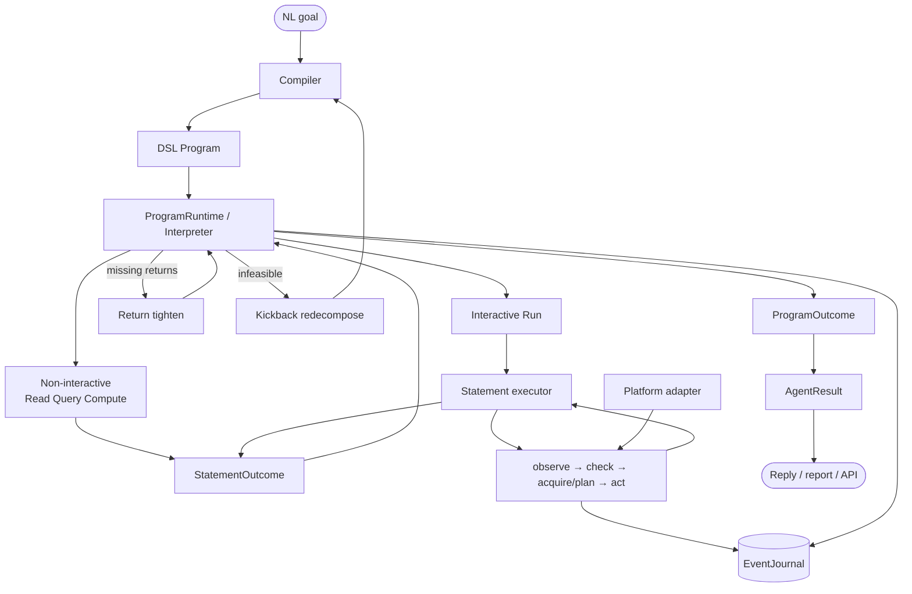
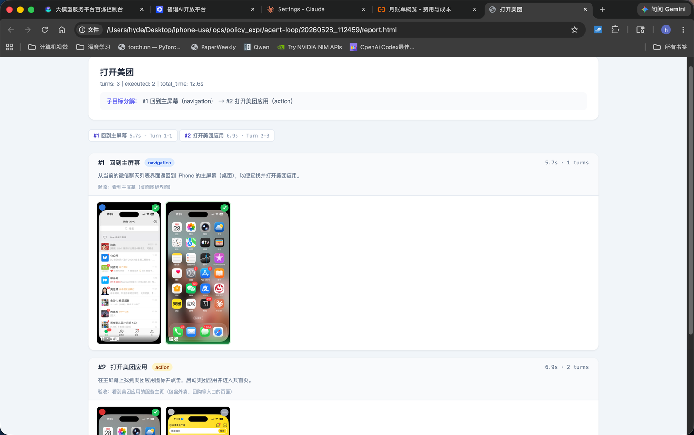

# GUIWeave

English | [中文](README.zh-CN.md)

> **About the name:** The project started on iPhone and now targets browser, iPhone, and Android, so it has become **GUIWeave**. The Python package remains `gui_agent`; existing local checkouts may still use the former directory name.

**A programmable runtime for GUI agents: compile a goal into a typed program, then execute it against real interfaces.**

## First principle: a GUI task is not just GUI interaction

GUIWeave starts from one premise: **a GUI task is not continuous GUI interaction.** A task also contains control flow, variable binding, reads, queries, computation, aggregation, and recovery. Those belong in the runtime; only operations that truly depend on the interface enter the agent loop.

```text
Typical: Goal ─► [ observe → reason → act → done? ] × N ─► Result
                    plan · memory · recovery also live here

GUIWeave: Goal ─► DSL Program ─► ProgramRuntime ─► ProgramOutcome
                                         ├─ non-GUI: control flow · data · recovery
                                         │           If · ForEach · Call · Read · Query · Compute
                                         └─ GUI I/O: Run ─► agent loop ─► StatementOutcome
```

**What you get**

- **Branch, loop, and aggregate in the program** — not by hoping the model remembers the plan across clicks.
- **Bounded failure recovery** — page replan → return tighten → kickback redecompose, under explicit budgets — not “retry the whole vibe.”
- **Honest completion** — `phase` + `verification` (`confirmed` vs `accepted_unverified`), evidence and reads as returns — not a single success boolean.

**What the program looks like** (illustrative shape, not exact syntax):

```text
Run     open orders and filter: paid, last week
ForEach row in result_rows:
  Run   open detail
  Read  amount, status
Query   SUM(amount) WHERE status = paid
Finish
```

Only the `Run` lines enter the GUI loop. Everything else is deterministic runtime work.

- **The task becomes executable:** prose plans become a typed DSL `Program`; control and data processing no longer have to be simulated through clicks.
- **The agent loop becomes bounded I/O:** the interpreter schedules statements; the loop handles only local GUI tactics.
- **The result becomes explicit:** `StatementOutcome` carries `phase`, verification, reads, and evidence; bounded recovery is recorded in `EventJournal`.

Browser, iPhone, and Android are replaceable I/O backends. Moving orchestration and completion semantics out of the model **reduces planning load** so longer workflows are practical with smaller multimodal models (e.g. Qwen3.5-35B-A3B), including private OpenAI-compatible endpoints. It does **not** remove vision or grounding errors — perception quality still matters.

Planner-executor and multi-agent stacks do not change this boundary if plans stay prose and workers return text or booleans. RPA sits at the other extreme and scripts every step. GUIWeave is in the middle: **explicit workflow, bounded GUI uncertainty.**

---

## Benchmarks

We evaluate on **WebArena-Verified** (browser) and **MobileWorld** GUI-only (Android). Scores will be published here with commit SHA, model profile, task-set version, attempt policy, and artifact links. **No number is claimed until those artifacts exist.**

| Benchmark | Scope | Primary metric | Status |
|-----------|-------|----------------|--------|
| **WebArena-Verified** | Shopping Admin, Shopping, Reddit, GitLab (single-site) | Task success rate | Pending reproducible run |
| **MobileWorld** | Android **GUI-only** (no privileged API / task shortcuts) | State-based success rate | Pending reproducible run |

Harness: `./bin/webarena <id>`, `bin/mobileworld <task>`.

---

## Runtime architecture



| Layer | Owns | Must not own |
|-------|------|--------------|
| Compiler | Program semantics and statement contracts | Pixels or page tactics |
| ProgramRuntime / interpreter | Program cursor, env, statement order, recovery budgets | Page click targets |
| Run loop | Observe/act lifecycle, persistence, recovery routing under runtime budgets | Program cursor or variable binding |
| Statement executor | Tactics and terminal outcome for one interactive statement | Program rewrites or task completion |
| Action policy | One grounded action proposal | Statement or task completion |
| Adapter | Observation and device I/O | Goal semantics |

Program checkpoints plus the ordered journal can reconstruct interpreter and recovery state across a process boundary. Live UI state inside an unfinished statement is intentionally not replayed.

Deep dive: [`docs/dsl_runtime_architecture.md`](docs/dsl_runtime_architecture.md).

---

## What a run looks like

Same runtime on every platform. The HTML report shows **program statements**, annotated screenshots, timing, and verification — the execution trace of the DSL program, not a flat click log.



### Surface demos (iPhone adapter)

The clips below use the **iPhone** I/O backend (Chinese apps; patterns are general). Browser work uses the same runtime via CDP; see WebArena harness and the report above.

**Information workflow + zero-preempt** (actions go to the mirror window; your Mac cursor stays free):

> "How much did I spend via WeChat Pay from the 21st to the 28th last month?"

https://github.com/user-attachments/assets/6805dd78-fd8c-4b23-9f85-4409851882e7

*1x real-time.* · Preemptive comparison (older input path, 2x): https://github.com/user-attachments/assets/2deb4026-97e9-4689-bfa7-30472544d3df

**Cross-app action** (2x):

https://github.com/user-attachments/assets/3b10c74a-99ae-4bbb-a983-767857b62136

**App recon → knowledge base** (2x):

https://github.com/user-attachments/assets/183b80fd-ba0f-4f14-b599-b7ef3efc4a79

---

## Platforms (I/O backends)

| Platform | Drive path | Notes |
|----------|------------|--------|
| **Browser** | Chrome CDP + Playwright | Admin UIs, long forms, WebArena harness |
| **iPhone** | macOS Mirroring + mirroir / `mirror_daemon` | Real apps; optional **zero-preempt** input |
| **Android** | adb + scrcpy | USB or wireless |

```bash
bin/runner browser "…"
bin/runner iphone "…"
bin/runner android "…"
```

Default `AGENT_PLATFORM` is still `iphone` (historical); pass the platform explicitly in scripts.

---

## Capabilities and limits

**Fits**

- Multi-step UI work that needs structure: filters, forms, lists, detail pages, aggregates
- Browser admin / benchmark-style tasks (`./bin/webarena <id>`)
- Cross-page or cross-app flows as sequential / looped statements
- Private small-model deployments when contracts carry orchestration and verification load

**Does not fit**

- CAPTCHA / biometrics, real-time games, DRM-blank frames
- Tasks that invent business truth with no UI evidence

**Current limitation:** Android scroll-to-boundary collection is not implemented yet; direct-action and single-screen MobileWorld tasks are the supported subset today.

---

## Quick start

> **Project status:** active development. The irreversible-action safety gate is not complete; use test accounts and supervise tasks that can pay, delete, publish, or send data.

```bash
uv sync

# Browser
bin/launch_chrome_cdp
bin/runner browser "open the orders page and list recent paid orders"

# iPhone (needs Mirroring; mirroir-mcp for mirroir mode)
brew tap jfarcand/tap && npx -y mirroir-mcp install
bin/runner iphone "open WeChat and go to contacts"

# Android
ANDROID_SERIAL=<serial|host:port> bin/runner android "open Settings"
```

`.env` example:

```env
API_PROVIDER=modelscope
MODELSCOPE_API_KEY=your_api_key
```

| Variable | Values | Default |
|----------|--------|---------|
| `AGENT_PLATFORM` | `iphone` / `browser` / `android` | `iphone` (historical) |
| `AGENT_MODE` | `daemon` / `mirroir` (`silent` / `standard` aliases) | `daemon` in `bin/runner` |
| `AGENT_MODEL` | config profile | `qwen35` |
| `AGENT_HEADLESS` | `1` hide HUD | off |

- LLM profiles: `gui_agent/core/config/config.yaml`
- Chat: `bin/chat` / `bin/chat browser`
- Tests: `uv run pytest tests/ -q` (no device)

```bash
./bin/webarena <task_id>
./bin/webarena --headless <task_id>
bin/mobileworld --list
bin/mobileworld <task_name>
bin/iphone_recon --app 微信 --depth 2
bin/report logs/…
```

iPhone screenshot server (`bin/sck_server`, ScreenCaptureKit) avoids firing the recording indicator every frame. Rebuild: `swiftc sck/sck_stream_server.swift -o bin/sck_server`.

---

## Repository layout

```text
gui_agent/
├── core/
│   ├── orchestrator/   # DSL language, compiler, validator, interpreter, recovery
│   ├── run/            # ProgramRuntime, statement dispatch, loop, AgentResult, journal
│   ├── supervisor/     # Interactive statement executor
│   ├── runtime/        # Platform contracts + factory
│   ├── chat/ · llm/ · schemas/ · config/ · self_learning/
├── adapters/           # browser · iphone · android
└── reports/            # HTML traces
bin/                    # runner, chat, webarena, mobileworld, report, …
knowledge/              # App/site facts (not core prompts)
tests/                  # Deterministic + contract suite
evals/                  # LLM-facing evals
docs/                   # Runtime architecture
```

**Knowledge** under `knowledge/{browser|iphone|android}/` is domain facts only.  
**User memory** may persist chat preferences in `data/user_preferences.json`.

## Tech stack

Python 3.11+, `uv`, `pydantic` · OpenAI-compatible LLMs · Playwright/CDP · iPhone mirroir/`mirror_daemon`/SCK · Android adbutils/scrcpy · pillow/imagehash · rich/prompt-toolkit

## TODO

- Safety gate for irreversible actions (pay / delete / send)
- Publish reproducible WebArena-Verified and MobileWorld snapshots under [Benchmarks](#benchmarks)
