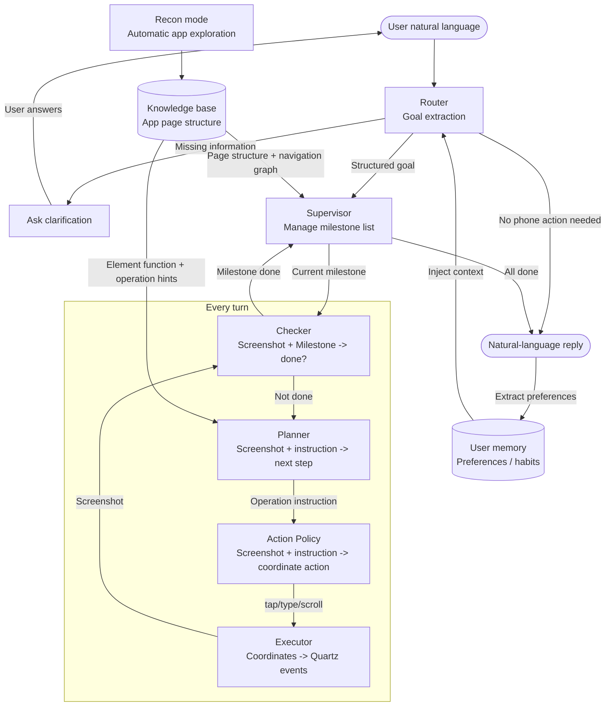

# iphone-use

English | [中文](README.zh-CN.md)

An AI agent that controls a real iPhone through macOS iPhone Mirroring.

It uses [mirroir-mcp](https://github.com/jfarcand/mirroir-mcp) to obtain screenshots and send touch events through the MCP protocol. Given a natural-language goal, the agent repeatedly observes the current screen, reasons about the next step, executes an action, and verifies progress until the task is complete.

**iphone-use can drive long-horizon mobile workflows with a multimodal small model such as Qwen3.5-35B-A3B, including cross-app tasks, multi-step navigation, and explicit completion checks. It is designed to work with private or self-hosted OpenAI-compatible model providers, without depending on closed-source frontier models.**

## Demos

All demo videos below are played at 2x speed. The UI and agent traces are in Chinese because the demos use real Chinese apps, but the task patterns are general mobile GUI workflows.

### Chat Mode

**Action workflow**: execute concrete actions such as sending a message, placing an order, or changing a setting.

> "Share the baby formula I recently ordered from the shopping app with Lao Be, and say it is good value for money."
>
> E-commerce app -> find a recent order -> share to a messaging app contact. This is a cross-app mobile workflow.

https://github.com/user-attachments/assets/3b10c74a-99ae-4bbb-a983-767857b62136

**Information workflow**: read and summarize information inside an app, such as bills, order history, or message threads.

> "How much did I spend via WeChat Pay last week?"
>
> Open the payment bill page -> filter/read last week's transactions -> summarize the spending.

https://github.com/user-attachments/assets/2deb4026-97e9-4689-bfa7-30472544d3df

### Recon Mode

> Automatically explore the page structure of a marketplace app and generate a reusable page knowledge base.

https://github.com/user-attachments/assets/183b80fd-ba0f-4f14-b599-b7ef3efc4a79

## Architecture



**Router** parses the user message and decides whether the phone needs to be operated. If yes, it extracts the concrete goal and target app, then passes them to the Supervisor. If no phone action is needed, it replies directly. If key information is missing, it asks a clarification question.

**Supervisor** decomposes a goal into dependent milestone tasks and executes them one by one with verification. It supports different completion strategies, including single-state confirmation, scroll-based collection, and repeat-until-satisfied workflows. When the agent gets stuck, it can trigger replanning.

**Planner** reads the current screenshot and the active operation instruction, optionally using the page knowledge base, and decides the next concrete step.

**Action Policy** converts a high-level operation instruction into screen-coordinate actions such as `tap`, `type`, `scroll`, and `drag`.

**Executor** sends coordinate actions as Quartz mouse and keyboard events, which control the iPhone through iPhone Mirroring.

**Output** generates the final user-facing response after the task completes. For information workflows, it returns the extracted data or summary.

## Robustness

**Checker-based verification** runs before each action. It judges whether the current milestone is actually complete from the screenshot, reducing false positives caused by LLM hallucination, such as mistaking a bottom tab for task completion.

**Stuck detection** identifies failures through screen similarity across consecutive frames and repeated operation instructions. When triggered, the system enters a replan flow.

**Replan** diagnoses why the agent is stuck and proposes an alternative strategy, such as using a different navigation path, replacing a scroll with a tap, or escalating to human intervention.

## Capabilities and Limits

**Works well for**

- Fixed mobile workflows: sending messages, placing orders, filling forms, changing settings
- In-app information retrieval: spending summaries, order records, page content extraction
- Cross-app tasks: retrieving content in one app and using it in another app

**Not suitable for**

- Steps that require CAPTCHA, Face ID, or Touch ID
- Real-time interaction scenarios such as games or live streams
- Complex gestures such as 3D Touch or long-press menus
- Screenshots that are blank or black because of screen-protection or DRM restrictions

## Requirements

- macOS Sequoia 15.0 or later, required by iPhone Mirroring
- An iPhone paired with the Mac through iPhone Mirroring
- An OpenAI-compatible LLM provider, such as ModelScope, DashScope, local inference, or a self-hosted service

## Setup

```bash
# Install mirroir-mcp, the MCP server used for iPhone control
brew tap jfarcand/tap
npx -y mirroir-mcp install

# Install Python dependencies
uv sync
```

Copy `.env` and fill in your API configuration:

```env
API_PROVIDER=modelscope
MODELSCOPE_API_KEY=your_api_key
```

Model assignments for each module are configured in `policy_expr/config.yaml`.

### Screenshot Server

The agent uses `bin/sck_server` (a compiled Swift binary) to take screenshots via ScreenCaptureKit instead of the system `screencapture` command. This avoids triggering the iOS recording indicator on every frame — it fires only once when the stream starts.

The binary is pre-compiled for Apple Silicon (arm64). If you modify the Swift source, recompile:

```bash
swiftc sck/sck_stream_server.swift -o bin/sck_server
```

## Entry Points

### Chat Mode

```bash
bin/chat
```

Interactive multi-turn chat interface. It supports consecutive tasks and maintains session context and task progress.

### Runner

Useful for experiments and debugging.

```bash
# Single-step execution
uv run python policy_expr/runner.py "open WeChat"

# Multi-step agent loop
uv run python policy_expr/runner.py "open WeChat and go to contacts" \
  --mode agent-loop --supervisor milestone --auto-continue --max-turns 15

# Visual run with HUD
uv run python policy_expr/runner.py "check today's food delivery orders" \
  --mode agent-loop --supervisor milestone --auto-continue --hud
```

### App Reconnaissance

Generate a reusable knowledge base for an app.

```bash
# Explore an app and generate page knowledge
uv run python -m policy_expr.recon_cli --app 微信 --depth 2

# Manually navigate to a new page, then append it to an existing knowledge base
uv run python -m policy_expr.recon_cli --app 微信 --mode add --depth 1

# Update knowledge for a specific page
uv run python -m policy_expr.recon_cli --app 微信 --mode update \
  --target "WeChat main screen, showing chat list and bottom navigation"
```

`--depth N` controls the DFS exploration depth. Pages from depth `0` to `N-1` are explored and converted into knowledge; depth `N` pages are only recorded.

## Project Structure

```text
policy_expr/
├── chat_cli.py          # Chat mode entry point
├── runner.py            # Experimental/debug runner
├── recon_cli.py         # App reconnaissance CLI
├── executor.py          # Action executor: Quartz + MCP
├── perception.py        # Screenshot perception layer
├── output.py            # Final response generation
├── schemas.py           # Core data models
├── config.yaml          # LLM provider/model configuration
├── prefs.py             # User preference memory
├── supervisor/
│   └── milestone.py     # Milestone state machine: decompose -> execute -> verify
├── policies/
│   ├── base.py          # ActionPolicy interface
│   └── structured_output.py  # Vision LLM action policy
├── recon/
│   ├── page_parser.py   # Screenshot -> page identity + interactive elements
│   ├── dfs.py           # Multi-depth DFS app exploration
│   ├── bfs.py           # BFS element probing
│   ├── back_nav.py      # Return navigation from child pages
│   ├── page_identity.py # Page deduplication with visual fingerprints
│   └── cascade_matcher.py  # Cascaded visual/semantic page matching
└── self_learning/
    ├── knowledge.py     # Generate knowledge files from recon results
    └── app_summary.py   # Discover and load app knowledge

knowledge/               # Per-app page knowledge base in Markdown
data/user_preferences.json  # Persistent user preference memory
evals/                   # Module-level evaluation cases and scripts
llm/                     # Structured-output LLM wrappers
models/                  # Local models, such as YOLO icon detection
scripts/                 # Utility scripts for tests and visualization
```

## Knowledge Base

After app reconnaissance, generated page knowledge is stored under `knowledge/{app}/`. Each page contains:

- Page identity description, including title, type, and key visual elements
- Interactive elements and their functional descriptions
- Navigation relationships to reachable child pages

At runtime, the Runner automatically loads relevant knowledge for the target app. This helps the Supervisor understand page structure and helps the Planner choose better navigation steps.

## User Memory

After each completed task, the system extracts user preferences from the conversation, such as commonly used apps, frequent contacts, and habitual options. These preferences are persisted in `data/user_preferences.json` and injected into future tasks when relevant.

## Evaluation

Core modules have independent evaluation suites that do not require a real phone. They call the LLM and assert against expected structured outputs.

```bash
uv run python evals/<module>/test_<module>.py
```

See [`evals/README.md`](evals/README.md) for details.

## Tech Stack

- Python 3.11+
- `mcp` — MCP client connected to `mirroir-mcp` for phone control
- `langchain-openai` / `langchain-qwq` — LLM calls through OpenAI-compatible providers
- `onnxruntime` — YOLO icon detection with ONNX inference for coordinate snapping
- `ocrmac` — Native macOS OCR
- `Quartz` — macOS mouse and keyboard event injection
- `pillow` / `numpy` / `scikit-image` / `imagehash` — Image processing
- `torch` + `transformers` + `sentence-transformers` — CLIP-based visual matching in `cascade_matcher`, loaded on demand
- `pydantic` — Data models
- `rich` + `prompt-toolkit` — Terminal UI
- `uv` — Package management

## TODO

- **Safety gate for risky actions**: add human confirmation before irreversible or sensitive operations, such as payment confirmation, data deletion, or sending messages.
