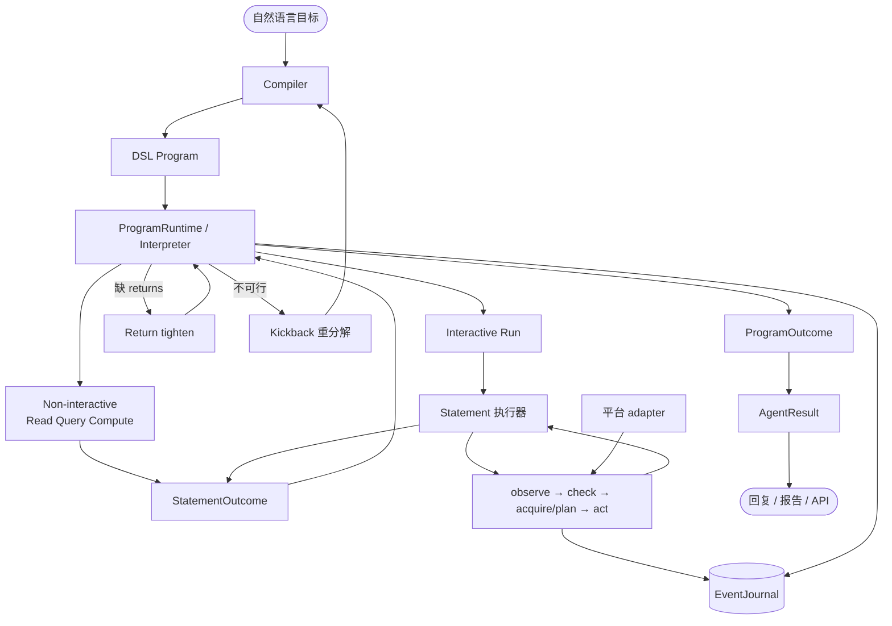

# GUIWeave

[English](README.md) | 中文

> **关于名称：** 项目从 iPhone 单端起步，现已面向浏览器、iPhone 和 Android，因此演进为 **GUIWeave**。Python 包名仍保留 `gui_agent`；已有本地 checkout 可能仍使用旧目录名。

**面向 GUI Agent 的可编程 Runtime：把目标编译成类型化程序，再在真实界面上执行。**

## 第一性原理：GUI 任务不等于全程 GUI 交互

GUIWeave 从一个简单前提出发：**GUI 任务不等于全程 GUI 交互。** 任务还包含控制流、变量绑定、读取、查询、计算、汇总和恢复；这些归 Runtime，只有真正依赖界面的操作才进入 Agent 环。

```text
典型：目标 ─► [ 观察 → 推理 → 动作 → 做完了？ ] × N ─► 结果
                    计划 · 记忆 · 恢复也都在环里

GUIWeave：目标 ─► DSL Program ─► ProgramRuntime ─► ProgramOutcome
                                         ├─ 非 GUI：控制流 · 数据 · 恢复
                                         │          If · ForEach · Call · Read · Query · Compute
                                         └─ GUI I/O：Run ─► Agent 环 ─► StatementOutcome
```

- **任务变成可执行程序：** prompt 里的文本计划变成类型化 DSL `Program`，控制与数据处理不再由点击环模拟。
- **Agent 环变成有界 I/O：** Interpreter 调度 statement，Agent 环只做局部 GUI 战术。
- **结果变成显式返回值：** `StatementOutcome` 返回 `phase`、验证、reads 和证据；有预算的恢复记入 `EventJournal`。

浏览器、iPhone 和 Android 只是可替换的 I/O 后端。把控制流和完成语义从模型中移出后，Qwen3.5-35B-A3B 等较小的多模态模型也能承载更长流程；模型质量仍会影响感知和局部规划。支持私有化 OpenAI 兼容接口。

Planner-Executor 和 Multi-Agent 如果仍用文本计划和文本 / bool 返回值，并没有改变这个边界；RPA 位于另一端，把每一步都脚本化。GUIWeave 介于两者之间：工作流显式，GUI 不确定性有界。

---

## Benchmark 效果

这里预留可复现的项目效果展示。在运行产物和评测配置可用之前，不发布未经验证的分数。

| Benchmark | 范围 | 主指标 | 结果 |
|-----------|------|--------|------|
| **WebArena-Verified** | 四个单站点：Shopping Admin、Shopping、Reddit、GitLab | 任务成功率 | _待完成可复现运行_ |
| **MobileWorld** | Android **GUI-only** 任务；不使用特权 App API 或任务特化快捷路径 | 基于状态的任务成功率 | _待完成可复现运行_ |

每次发布结果时，应同时给出 commit SHA、模型 profile、任务集版本与数量、尝试策略、evaluator / 环境版本，以及报告或原始产物链接，确保 Runtime 和模型变更前后的数字可比较。

---

## Runtime 架构



| 层 | 拥有 | 不得拥有 |
|----|------|------------|
| Compiler | Program 语义和 statement 合同 | 像素或页内战术 |
| ProgramRuntime / interpreter | Program 游标、env、statement 顺序、恢复预算 | 页内点击目标 |
| Run loop | observe/act 生命周期、持久化、在 runtime 预算下路由恢复 | Program 游标或变量绑定 |
| Statement 执行器 | 一个交互 statement 的战术和终态 | Program 改写或任务终态 |
| Action policy | 一次 grounding 后的动作建议 | Statement 或任务完成 |
| Adapter | 观察与设备 I/O | 目标语义 |

Program checkpoint 与有序 journal 可在跨进程边界后重建 interpreter 和 recovery 状态；未完成 statement 内的实时 UI 状态不做回放。

---

## 平台（I/O 后端）

| 平台 | 驱动方式 | 说明 |
|------|----------|------|
| **Browser** | Chrome CDP + Playwright | WebArena、后台、长表单 |
| **iPhone** | macOS 镜像 + mirroir / `mirror_daemon` | 真机 App；可选 **非抢占** 输入 |
| **Android** | adb + scrcpy | USB / 无线 |

```bash
bin/runner browser "…"
bin/runner iphone "…"
bin/runner android "…"
```

---

## 演示（iPhone 表面）

同一套 Runtime，换移动端 adapter。界面与轨迹用中文 App，任务形态通用。倍速见各视频说明。

**查询类 + 非抢占**（动作投递给镜像窗口，Mac 光标不被抢走）：

> 「我上个月 21 号到 28 号用微信支付花多少钱了？」

https://github.com/user-attachments/assets/6805dd78-fd8c-4b23-9f85-4409851882e7

*原速 1x。*

抢占式对照（旧输入路径）：

https://github.com/user-attachments/assets/2deb4026-97e9-4689-bfa7-30472544d3df

*2x。*

**跨 App 操作：**

https://github.com/user-attachments/assets/3b10c74a-99ae-4bbb-a983-767857b62136

*2x。*

**应用侦察 → 知识库：**

https://github.com/user-attachments/assets/183b80fd-ba0f-4f14-b599-b7ef3efc4a79

*2x。*

**执行报告**（program statement、截图、验收）：


---

## 能力边界

**适合**

- 需要结构的多步 UI：筛选、表单、列表、详情、汇总
- 浏览器后台 / 评测向任务（`./bin/webarena <id>`）
- 用顺序 / 循环 statement 表达的跨页、跨 App 流程
- 合同扛验收负载时的私有小模型部署

**不适合**

- 验证码 / 生物识别、强实时游戏、DRM 空白帧
- 没有界面证据却要求编造业务结论

**当前限制：** Android 尚未实现滚动到边界的全量采集；目前主要支持直接操作和单屏 MobileWorld 任务。

---

## 快速开始

> **项目状态：** 正在活跃开发。不可逆操作的安全门控尚未完成；请使用测试账号，并人工监督涉及支付、删除、发布或发送数据的任务。

```bash
uv sync

# 浏览器
bin/launch_chrome_cdp
bin/runner browser "打开订单页并列出最近已支付订单"

# iPhone（需 Mirroring；standard 模式可装 mirroir-mcp）
brew tap jfarcand/tap && npx -y mirroir-mcp install
bin/runner iphone "打开微信并进入通讯录"

# Android
ANDROID_SERIAL=<序列号|host:port> bin/runner android "打开设置"
```

`.env` 示例：

```env
API_PROVIDER=modelscope
MODELSCOPE_API_KEY=your_api_key
```

- 模型 profile：`gui_agent/core/config/config.yaml`
- 对话：`bin/chat` / `bin/chat browser`
- 测试：`uv run pytest tests/ -q`（无需真机）
- 架构深读：[`docs/dsl_runtime_architecture.md`](docs/dsl_runtime_architecture.md)

| 变量 | 取值 | 默认 |
|------|------|------|
| `AGENT_PLATFORM` | `iphone` / `browser` / `android` | `iphone` |
| `AGENT_MODE` | `daemon` / `mirroir`（`silent` / `standard` 为别名） | `bin/runner` 中为 `daemon` |
| `AGENT_MODEL` | config profile | `qwen35` |
| `AGENT_HEADLESS` | `1` 关 HUD | 关 |

### 更多入口

```bash
./bin/webarena <task_id>
./bin/webarena --headless <task_id>
bin/mobileworld --list
bin/mobileworld <task_name>
bin/iphone_recon --app 微信 --depth 2
bin/report logs/…
```

iPhone 截图服务 `bin/sck_server`（ScreenCaptureKit）避免每帧触发录屏指示灯。重编译：`swiftc sck/sck_stream_server.swift -o bin/sck_server`。

---

## 仓库结构

```text
gui_agent/
├── core/
│   ├── orchestrator/   # DSL 语言、编译、校验、解释器、恢复
│   ├── run/            # ProgramRuntime、statement 分派、loop、AgentResult、journal
│   ├── supervisor/     # 交互 statement 执行器
│   ├── runtime/        # 平台契约 + 工厂
│   ├── chat/ · llm/ · schemas/ · config/ · self_learning/
├── adapters/           # browser · iphone · android
└── reports/            # HTML 轨迹
knowledge/              # 应用/站点事实（不进 core prompt）
tests/                  # 确定性 + 契约套件
evals/                  # LLM 向评测
docs/                   # Runtime 架构
```

**知识库** 在 `knowledge/{browser|iphone|android}/`，只放领域事实。

**用户记忆** 可把对话偏好落到 `data/user_preferences.json`。

## 技术栈

Python 3.11+、`uv`、`pydantic` · OpenAI 兼容 LLM · Playwright/CDP · iPhone mirroir/`mirror_daemon`/SCK · Android adbutils/scrcpy · pillow/imagehash · rich/prompt-toolkit

## TODO

- 不可逆操作（支付 / 删除 / 发送）前的安全门控
