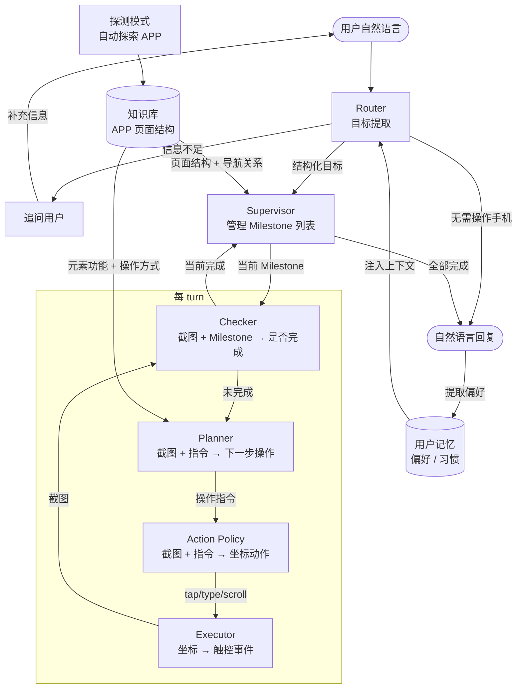

# iphone-use

[English](README.md) | 中文

基于 Mac 上的 iPhone Mirroring，用 AI Agent 自动控制 iPhone。给出自然语言目标，Agent 自动截图、理解当前状态、决策下一步操作、执行并循环，直到完成任务。

**多模态小模型（Qwen3.5-35B-A3B）即可驱动复杂的手机操作（跨 APP、长程多步骤、带验收闭环），支持私有化本地部署，无需依赖闭源大模型。**

## 主要进展

- **里程碑监督的 GUI Agent**：任务分解 → 执行 → 验收/重规划闭环，配合应用侦察与页面知识库，用 Qwen3.5-35B 这类小模型可靠跑通长程移动端任务。彼时输入为**抢占式**——操作时接管 Mac 的鼠标键盘。
- **非抢占输入**：操作直接投递给镜像窗口，不抢鼠标 / 键盘 / 前台焦点，智能体在后台操作手机时，你可以照常用电脑做别的事。

## 演示

各演示的播放倍速见视频下方小字。

### 对话模式

**查询类**：从 APP 内读取并汇总信息（账单统计、订单记录、消息摘要）

**非抢占输入**是这个项目的一个重要特性。多数 GUI / Computer-Use 智能体是**抢占式**的——接管你的鼠标键盘，运行时你没法同时用电脑；本项目把操作**直接投递给镜像窗口**，不抢光标、不抢前台焦点，智能体在后台操作手机时，你可以照常用电脑做别的事。

下面是同一个微信账单查询的两种跑法：

非抢占式：

> "我上个月21号到28号用微信支付花多少钱了？"
>
> 设自定义日期区间（日期选择器）→ 滚动采集区间内交易 → 汇总支出，全程光标不被抢走

https://github.com/user-attachments/assets/6805dd78-fd8c-4b23-9f85-4409851882e7

*该演示为原速播放（1x，未加速）*

抢占式：

> "我上周用微信支付花多少钱了？"
>
> 打开微信支付 → 汇总上周账单支出

https://github.com/user-attachments/assets/2deb4026-97e9-4689-bfa7-30472544d3df

*该演示为 2 倍速播放*

**操作类**：执行具体动作（发消息、下单、修改设置）

> "把我最近在拼多多上下单的奶粉分享给老 Be，这个性价比高"
>
> 拼多多找订单 → 微信分享给联系人，跨 APP 操作

https://github.com/user-attachments/assets/3b10c74a-99ae-4bbb-a983-767857b62136

*该演示为 2 倍速播放*

### 探测模式

> 自动探索闲鱼 APP 页面结构，生成页面知识库

https://github.com/user-attachments/assets/183b80fd-ba0f-4f14-b599-b7ef3efc4a79

*该演示为 2 倍速播放*

## 架构



**Router**：解析用户消息，判断是否需要操作手机。需要的提取明确目标（做什么）和目标 APP（在哪个应用做），传递给 Supervisor；不需要的直接回复。当信息不足时追问用户。

**Supervisor**：将目标拆解为有依赖关系的 Milestone 子任务，逐个执行并验收。支持多种完成策略（单步确认、滚动采集、重复直到满足条件），遇到卡住时自动 replan。

**Planner**：根据当前截图和操作指令，结合知识库中的页面元素信息，规划下一步具体操作。

**Action Policy**：接收截图和操作指令，输出具体的屏幕坐标动作（tap / type / scroll / drag 等）。

**Executor**：将坐标动作发送到手机。`silent` 模式使用内置 `mirror_daemon` 后端（零抢占，不移动光标、不切换前台窗口）；`standard` 模式通过 mirroir-mcp 注入 Quartz 事件。

**Output**：任务完成后，根据执行过程和屏幕内容生成面向用户的自然语言回复，查询类任务直接输出提取到的数据。

## 健壮性机制

**Checker** 在每轮执行前对截图做验收判断，确认当前 Milestone 是否真正完成，防止 LLM 幻觉导致的误判（如把底部 Tab 误认为任务完成）。

**卡住检测** 通过两个维度识别异常：屏幕相似度（连续多帧无变化）和指令重复率（同一操作反复出现）。触发后进入 Replan 流程。

**Replan** 分析卡住原因，生成替代策略。常见处理：换一条路径绕过死路、改用其他操作方式（如把 scroll 换成 tap）、或降级为人工介入。

## 能力边界

**适合的任务**

- 固定流程的操作类任务：发消息、下单、填表、修改设置
- 数据查询类任务：统计账单、读取订单记录、提取页面信息
- 跨 APP 任务：从一个 APP 获取内容，在另一个 APP 中使用

**不适合的任务**

- 依赖验证码或生物识别（Face ID / Touch ID）的步骤
- 需要实时反应的场景（游戏、直播互动）
- 涉及 3D Touch、长按弹出菜单等复杂手势的操作
- 截图内容为空白/黑屏时（投屏保护或 DRM 内容）

## 前置条件

- macOS Sequoia 15.0 或以上（iPhone Mirroring 功能要求）
- iPhone 已通过 iPhone Mirroring 与 Mac 完成配对
- 兼容 OpenAI API 的 LLM 服务（ModelScope、Dashscope、本地推理或自建服务）

## 环境配置

```bash
# 安装 mirroir-mcp（standard 模式使用）
brew tap jfarcand/tap
npx -y mirroir-mcp install

# 安装 Python 依赖
uv sync
```

复制 `.env` 并填写 API 配置：

```env
API_PROVIDER=modelscope
MODELSCOPE_API_KEY=your_api_key
```

各模块使用的模型在 `gui_agent/config.yaml` 中配置。

### 截图服务

Agent 使用 `bin/sck_server`（编译好的 Swift 二进制）通过 ScreenCaptureKit 截图，而非系统 `screencapture` 命令。这样做可以避免每帧触发 iOS 录屏指示灯——使用 SCStream 只在会话开始时触发一次。

二进制已预编译（Apple Silicon arm64）。如修改 Swift 源码，需重新编译：

```bash
swiftc sck/sck_stream_server.swift -o bin/sck_server
```

## 入口

### 对话模式（主入口）

```bash
bin/chat
```

多轮对话界面，支持连续下达任务，自动维护会话上下文和进度。

**会话内命令：**

| 命令 | 说明 |
|------|------|
| `/mode [silent\|standard]` | 切换输入后端。`silent` = 零抢占 mirror_daemon（默认）；`standard` = mirroir-mcp 原版 |
| `/model [qwen35\|qwen36]` | 切换模型 profile（config.yaml 的 `profiles`）。`qwen35` = 基线（默认）；`qwen36` = qwen3.6 核心模型 |
| `/supervisor` | 在 Milestone 与 Simple supervisor 之间切换 |
| `/clear` | 清空对话历史 |
| `/exit` | 退出 |

### Runner（实验/调试）

```bash
# 使用默认配置运行（silent 模式，qwen35）
bin/runner "打开微信并进入通讯录"

# 通过环境变量切换模型或模式
AGENT_MODEL=qwen36 bin/runner "打开微信"
AGENT_MODE=standard bin/runner "打开微信"
```

脚本化或编程调用：

```bash
uv run python -m gui_agent.core.runner "打开微信并进入通讯录" \
  --mode agent-loop --supervisor milestone --auto-continue --max-turns 15 --hud
```

**环境变量：**

| 变量 | 可选值 | 默认 | 说明 |
|------|--------|------|------|
| `AGENT_MODE` | `silent`、`standard` | `silent` | 输入后端 |
| `AGENT_MODEL` | `qwen35`、`qwen36` | `qwen35` | LLM 配置文件 |

### 任务执行可视化

每次运行后自动生成 HTML 报告，展示完整的任务执行轨迹：


- **子目标分解** — 名称、描述、验收条件
- **按子目标分行展示** — 每行一组缩略图，展示该子目标的操作步骤
- **Action 标注** — 点击圆圈、滚动箭头、输入文本气泡、拖拽起终点
- **模块耗时** — 每轮 checker / planner / action_policy 的 stacked bar 图
- **验收详情面板** — 点击验收缩略图展示 Checker 的推理依据（判断子目标完成的具体理由）

```bash
# Runner 运行后自动在日志目录生成 report.html
bin/runner "打开微信发一条消息"

# 从已有日志生成报告
python scripts/report.py runner --run logs/gui_agent/agent-loop/20260528_104755
```

### 应用侦察（生成知识库）

```bash
# 探测应用并生成页面知识库
uv run python -m gui_agent.adapters.iphone.recon_cli --app 微信 --depth 2

# 手动导航到新页面后，追加到已有知识库
uv run python -m gui_agent.adapters.iphone.recon_cli --app 微信 --mode add --depth 1

# 更新指定页面的知识
uv run python -m gui_agent.adapters.iphone.recon_cli --app 微信 --mode update \
  --target "微信主界面，显示聊天列表和底部导航栏"
```

`--depth N` 控制 DFS 探索层数，可生成知识的页面数为第 0 到 N-1 层（第 N 层只记录不探测）。

## 目录结构

```text
gui_agent/
├── core/
│   ├── runner.py        # 稳定 runner 模块入口
│   ├── run/             # agent loop、CLI、运行 IO/state/result 持久化
│   ├── runtime/         # 平台契约、执行器基类、平台工厂、trace
│   ├── vision/          # 帧分析、拼接、落点校验、可视化
│   ├── llm/             # reader、最终回复、时间表达式解析
│   ├── chat/            # 对话 CLI、路由、偏好、会话记录
│   ├── schemas/         # 核心数据模型和侦察数据结构
│   ├── config/          # LLM 配置和单价 profiles
│   ├── supervisor/      # Milestone 状态机：分解→执行→验收
│   ├── policies/        # 平台中性的 policy 接口
│   └── self_learning/   # 知识发现与加载
└── adapters/
    ├── iphone/          # iPhone 设备 IO、感知、侦察、策略
    ├── browser/         # Browser CDP 设备、感知、执行器、工厂
    └── android/         # Android adb 设备、感知、执行器、工厂

bin/
├── chat                 # 启动对话模式
├── runner               # 启动 Runner（AGENT_MODE / AGENT_MODEL 可配置）
└── mirror_daemon        # 零抢占输入后端二进制（silent 模式）

knowledge/               # 各应用页面知识库（Markdown）
data/user_preferences.json  # 用户偏好记忆（跨会话持久化）
evals/                   # 各模块测评用例和脚本
llm/                     # LLM 调用封装（structured output）
models/                  # 本地模型（YOLO 图标检测）
scripts/                 # 工具脚本（测试、可视化）
```

## 知识库

应用侦察后生成的页面知识存放在 `knowledge/{app}/`，按页面组织，每个页面包含：

- 页面身份描述（标题、类型、关键元素）
- 可交互元素列表及其功能描述
- 导航关系（从当前页面可到达哪些子页面）

Runner 运行时自动根据目标 APP 加载对应知识，帮助 Supervisor 理解页面结构和 Planner 制定操作步骤。

## 用户记忆

每次任务完成后，系统从对话中提取用户偏好（惯用 APP、常联系人、习惯选项等），持久化到 `data/user_preferences.json`。下次执行相似任务时自动注入上下文，无需重复说明。

## 测评

各核心模块均有独立测评套件，不依赖真机，直接对 LLM 输出做断言。

```bash
uv run python evals/<module>/test_<module>.py
```

详见 [`evals/README.md`](evals/README.md)。

## 技术栈

- Python 3.11+
- `mirror_daemon` — Swift 二进制，提供零抢占截图 + 触控输入（SCStream + SkyLight 私有 SPI），用于 silent 模式
- `mirroir-mcp` — 标准模式的手机控制 MCP server
- `mcp` — MCP client
- `langchain-openai` / `langchain-qwq` — LLM 调用（兼容 OpenAI API 的 provider）
- `onnxruntime` — YOLO 图标检测（ONNX 推理，用于点击坐标吸附）
- `ocrmac` — macOS 原生 OCR
- `Quartz` — macOS 事件注入（standard 模式）
- `pillow` / `numpy` / `scikit-image` / `imagehash` — 图像处理
- `torch` + `transformers` + `sentence-transformers` — CLIP 视觉匹配（cascade_matcher，按需加载）
- `pydantic` — 数据模型
- `rich` + `prompt-toolkit` — 终端 UI
- `uv` — 包管理

## TODO

- **安全操作门控**：对不可逆或高风险操作（支付确认、删除数据、发送消息等）增加人工确认机制，Executor 执行前拦截并提示用户确认。
